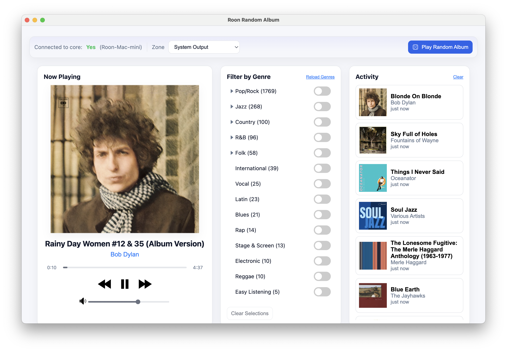

# Roon Random Album

A desktop application for discovering music through intelligent random album selection from your Roon library. Built with Electron and React, this app connects to your Roon Core to provide weighted genre filtering, artist exploration, and smart session tracking.

## Table of Contents

- [Features](#features)
- [Screenshots](#screenshots)
- [Installation](#installation)
- [Setup](#setup)
- [Usage](#usage)
- [Architecture](#architecture)
- [Configuration](#configuration)
- [Development](#development)
- [Troubleshooting](#troubleshooting)
- [Technical Notes](#technical-notes)
- [Contributing](#contributing)
- [Support](#support)

## Features

### 🎲 Smart Random Album Selection

- **Weighted Genre Selection**: Genres with more albums have proportionally higher chances of being selected
- **Hierarchical Genre Filtering**: Expandable genres reveal subgenres for more precise music discovery
- **Session Tracking**: Avoids repeating albums within the same session until all options are exhausted
- **Multi-Genre Support**: Select multiple genres and subgenres for varied listening experiences

### 🎯 Artist Exclusion Filtering

- **Exclude Specific Artists**: Prevent albums from selected artists from appearing in random selection
- **Settings Modal**: Clean filter icon button opens settings for managing exclusions
- **Add/Remove Artists**: Simple interface to add artists by name or remove them individually
- **Clear All**: Quickly remove all exclusions with confirmation
- **Persistent Storage**: Exclusions persist across app restarts
- **Smart Matching**: Case-insensitive matching handles collaborations ("Artist1 / Artist2")
- **Helpful Feedback**: Clear error message when all available albums are from excluded artists

### 🌐 Manual Connection

> **New in v1.7.0**: Connect to Roon Core via IP address

- **Auto-discovery or Manual**: Choose between automatic network discovery or manual IP configuration
- **Reliable Connection**: Ideal for complex networks, VPNs, or when auto-discovery fails
- **Connection Testing**: Test connectivity before saving settings
- **Easy Access**: Gmail-style dropdown in toolbar for quick connection mode switching

### 🎵 Now Playing Integration

- **Real-time Display**: Shows current track, album, artist, cover art, and track progress
- **Interactive Progress Bar**: Click anywhere on the progress bar to seek to that position in the track
- **Transport Controls**: Play, pause, next, previous with keyboard shortcuts
- **Volume Control**: Integrated volume slider for supported zones with mute function
- **Manual Refresh**: Refresh now-playing status to sync with latest Roon state
- **Blurred Background**: Subtle blurred album art backdrop enhances visual appeal

### 📚 Profile/Library Switching

- **Multiple Library Support**: Switch between different Roon profiles if your setup has multiple music libraries
- **Quick Switching**: Select different profiles from the toolbar to access separate collections
- **Seamless Transition**: Profile changes update available zones and content automatically
- **Automatic Detection**: Profiles appear only when your Roon setup has multiple libraries configured

**Note**: This feature is only available for Roon installations with multiple profiles configured in Roon Settings.

### 🎨 Artist Discovery

- **More from Artist**: Intelligent exploration of an artist's discography
- **Smart Cycling**: Plays through all other albums by an artist before repeating
- **Session Memory**: Remembers what you've heard to ensure variety

### 📱 Modern Interface

- **Clean Design**: Adaptive light/dark theme based on system preferences
- **Activity Feed**: Visual history of recently played albums from the app with replay functionality, persists across sessions
- **Responsive Layout**: Three-column grid optimizing space for different content types

### ⌨️ Keyboard Shortcuts

**Playback Controls:**

- `Space` - Play/Pause current track
- `→` - Next track
- `←` - Previous track

**Album Discovery:**

- `R` - Play random album (respects genre filters and artist exclusions)
- `A` - More from current artist (intelligent cycling through discography)

**Note**: Keyboard shortcuts work when the app window is focused.

## Screenshots

### Main Interface



_The app features a clean three-column layout with adaptive light/dark theme based on system preferences._

**Layout:**

- **Left Column**: Now Playing with album art, transport controls, and volume slider
- **Center Column**: Genre filter with toggleable selection, expandable subgenres (for genres with 50+ albums), and album counts
- **Right Column**: Activity feed showing recently played albums with replay functionality

**Additional Views:**

- Settings modal for artist exclusion management
- Manual connection configuration dialog
- Profile/library switching (when multiple Roon profiles configured)

## Installation

### System Requirements

- **macOS**: 12.0 (Monterey) or later
- **Windows**: Windows 10 (64-bit) or later
- **Roon**: Active Roon subscription and Roon Core running on your network

### Option 1: Download Pre-built Releases

#### macOS

1. Download the appropriate `.dmg` file from the [Releases](https://github.com/markmcc/roon-random-app/releases) page:
   - **Apple Silicon (M1/M2/M3/M4)**: Download the `-arm64.dmg` file
   - **Intel Macs**: Download the `-x64.dmg` file
2. Open the DMG and drag the app to your Applications folder
3. Launch "Roon Random Album" from Applications

The macOS app is signed and notarized, and should launch without issues. If launch is blocked, go to System Preferences > Security & Privacy > General tab, where you should see a message about the blocked app with an "Open Anyway" button.

If you get an error message stating that the app is damaged and can't be opened, it's been blocked by Gatekeeper. Go to the terminal and run: `xattr -dr com.apple.quarantine /path/to/Roon\ Random\ Album.app` which should clear the error and allow you to launch.

#### Windows

1. Download the `.msi` file from the [Releases](https://github.com/markmcc/roon-random-app/releases) page
   - File name format: `Roon-Random-Album-x.x.x.msi` (e.g., `Roon-Random-Album-1.8.0.msi`)
2. Double-click the MSI file to launch the installer wizard
   - **Note**: Windows SmartScreen may show a warning. The app is built and packaged automatically but does not include an EV code signing certificate. This is normal for open-source Electron apps.
   - Click "More info" then "Run anyway" to proceed with installation
3. Follow the installation wizard:
   - Choose installation location (default: `C:\Program Files\RoonRandomAlbum\`)
   - Installation creates a Start Menu entry and optional desktop shortcut
4. Launch from the Start Menu (search for "Roon Random Album")

**Uninstallation**: Use Windows Settings > Apps > Installed apps, or Control Panel > Programs > Uninstall a program

**Alternative**: Download the Windows ZIP file for a portable installation without an installer.

### Option 2: Build from Source

```bash
# Clone the repository
git clone https://github.com/markmcc/roon-random-app.git
cd roon-random-app

# Install dependencies
npm install

# Run in development mode
npm run dev

# Or build for production
npm run make
```

## Setup

### First Launch

1. Start the app
2. Ensure your Roon Core is running on the same network
3. The app will automatically discover and attempt to pair with your Roon Core
4. Authorize the connection in Roon (Settings > Extensions)
5. Select your preferred output zone from the dropdown

### Pairing with Roon

The app uses Roon's official API and requires authorization:

- Connection tokens are automatically managed and persisted
- Pairing status is displayed in the top toolbar
- No manual configuration required for auto-discovery

### Manual Connection

If auto-discovery doesn't work (VPN, complex network, firewall), use manual connection:

1. Click the **Roon Server** dropdown in the toolbar
2. Select **Manual connection**
3. Click **Connection settings...** at the bottom of the dropdown
4. Enter your Roon Core's IP address (find it in Roon Settings > About)
5. Enter the port (default is 9330)
6. Click **Test Connection** to verify
7. Click **Save & Reconnect**

The app will remember your settings. Switch back to auto-discovery anytime via the dropdown.

## Usage

### Basic Operation

1. **Select Genres** (optional): Click genres in the center panel to select/deselect them for filtering
2. **Choose Output Zone**: Select your desired audio output from the toolbar dropdown
3. **Play Random Album**: Click the dice button or press `R` to start playback

### Genre Filtering

- **How to Select**: Click on genre names to select/deselect them (selected genres are highlighted)
- **No Selection**: Chooses from your entire album library
- **Single Genre**: Plays only albums from that genre
- **Multiple Genres**: Uses weighted selection based on album counts per genre
- **Expandable Genres**: Genres with 50+ albums show a triangle icon - click the triangle to reveal subgenres
- **Subgenre Selection**: Click on subgenre names to individually select them for targeted discovery
- **Album Counts**: Numbers show how many albums each genre and subgenre contains
- **Mixed Selection**: Combine parent genres and specific subgenres for nuanced filtering
- **Clear All**: Use the "Clear Selections" button to deselect all genres at once

### Artist Exclusion

**Managing Artist Exclusions:**

1. Click the **filter icon** button in the toolbar (next to "Play Random Album")
2. Enter an artist name in the text field
3. Click **Add** to exclude that artist from random selection
4. Use **Remove** to delete individual exclusions
5. Click **Clear All** to remove all exclusions at once

**How It Works:**

- Albums from excluded artists will be automatically skipped during random selection
- Works with genre filtering - both filters apply together
- Case-insensitive matching (e.g., "beatles" matches "The Beatles")
- Handles collaborations by matching the primary artist name
- If all available albums are from excluded artists, you'll see a helpful error message

### Artist Exploration

- Click on artist name in Now Playing to explore the current artist's discography
- Smart session tracking ensures you hear different albums before repeats
- Automatically cycles through the artist's entire catalog

### Activity Feed

- Visual history of recently played albums
- Click any album to replay it instantly
- Timestamps show when each album was played
- Feed persists across sessions

### Profile Switching

**If you have multiple Roon profiles configured:**

1. Click the **Profile** dropdown in the toolbar
2. Select a different profile to switch music libraries
3. Available zones and content will update automatically

**Note**: This option only appears when your Roon setup has multiple profiles configured. Most users have a single profile and won't see this option.

## Architecture

### Technology Stack

- **Frontend**: React 18 with vanilla JavaScript (no JSX compilation)
- **Backend**: Electron main process with Node.js
- **Roon Integration**: Official Roon Labs API packages
- **Storage**: electron-store for persistent settings
- **Styling**: CSS custom properties with system theme adaptation

### Project Structure

```
├── main.js              # Electron main process entry point
├── roonService.js       # Core Roon API integration
├── ipcHandlers.js       # IPC communication bridge
├── preload.cjs          # Secure renderer-main communication
├── renderer/
│   ├── index.html       # Main UI template
│   └── index.js         # React application logic
├── assets/              # Application icons and resources
└── forge.config.cjs     # Electron Forge build configuration
```

### Key Components

- **Roon Service**: Handles all music library operations and playback
- **IPC Layer**: Secure communication between UI and music services
- **Session Management**: Tracks played albums and preferences
- **Genre Engine**: Weighted random selection with caching
- **Transport Integration**: Real-time playback control and status

## Configuration

### Persistent Settings

The app automatically saves:

- Roon Core pairing tokens
- Last selected output zone
- Genre filter preferences
- Window position and size

### Data Storage

- **macOS**: `~/Library/Application Support/Roon Random Album/`
- **Windows**: `%LOCALAPPDATA%\RoonRandomAlbum\`
- **Config File**: `config.json` contains all persistent state

## Development

### Prerequisites

```bash
node --version  # Should be 16.0.0 or higher
npm --version   # Should be 8.0.0 or higher
```

### Technical Requirements

- **Node.js**: 16.0.0 or higher (18.x or 20.x recommended for development)
- **npm**: 8.0.0 or higher
- **Electron**: 30.x (automatically installed with dependencies)
- **Roon Core**: Active Roon subscription and Roon Core running on your network

### Available Scripts

- `npm start` - Run the app in production mode
- `npm run dev` - Run with development debugging enabled
- `npm run make` - Build distributable packages
- `npm run package` - Package without creating installers
- `npm test` - Run tests in watch mode
- `npm run test:run` - Run tests once (CI mode)
- `npm run test:ui` - Run tests with Vitest UI (interactive mode)
- `npm run lint` - Check for linting issues
- `npm run lint:fix` - Auto-fix linting issues
- `npm run format` - Format code with Prettier
- `npm run format:check` - Check code formatting without making changes

### Building Distribution

```bash
npm run make
```

Creates platform-specific installers:

**macOS:**

- DMG installer (both ARM64 and Intel x64)
- ZIP archive for manual installation

**Windows:**

- MSI installer (WiX-based, standard Windows Installer format)
- ZIP archive for portable installation

Output in `out/` directory

### Code Style

- ES6 modules throughout
- Functional React components with hooks
- Comprehensive error handling
- Extensive logging for debugging

### Testing

The project uses [Vitest](https://vitest.dev/) for testing:

```bash
npm test          # Run tests in watch mode
npm run test:run  # Run tests once (for CI)
npm run test:ui   # Run tests with UI
```

Test files are located in the `test/` directory and cover:

- Input validation utilities (`validators.test.js`)
- Roon helper functions (`roonHelpers.test.js`)
- Activity management logic (`activityHelpers.test.js`)
- Roon service core logic (`roonService.test.js`)
- Text formatting utilities (`formatting.test.js`)
- Error handling classes (`AppError.test.js`)
- Activity service integration (`ActivityService.test.js`)

## Troubleshooting

### Connection Issues

- Ensure Roon Core is running and discoverable
- Check that both devices are on the same network
- Restart the app if pairing fails
- Verify firewall settings allow local network communication

### Audio Playback

- Confirm your output zone is powered on and available
- Check Roon's audio settings if no zones appear
- Volume control requires compatible Roon-managed devices

### Performance

- Genre list is cached for 1 hour to improve responsiveness
- Large libraries (>10,000 albums) may take longer for initial genre loading
- Session history is memory-only and resets on app restart

## Technical Notes

### Roon API Integration

- Uses official `node-roon-api` packages from Roon Labs
- Implements proper pairing and discovery protocols
- Handles real-time zone and transport updates
- Respects Roon's browsing and playback APIs

### Performance Optimizations

- **Image Caching**: Album artwork is cached in memory with LRU eviction to minimize Roon API calls
- **Genre Caching**: Genre lists are cached for 1 hour to improve responsiveness
- **Session History**: Up to 1,000 recently played albums tracked in memory to avoid repeats
- **Smart Prefetching**: Album metadata is prefetched during browsing for instant playback

### Security

- Content Security Policy prevents code injection
- Sandboxed renderer with controlled IPC communication
- No network access from renderer process
- Secure token storage with OS-level encryption

## License

MIT License - see [LICENSE](https://github.com/markmcclusky/roon-random-app/blob/main/LICENSE) file for details.

## Contributing

Contributions welcome! Please:

1. Fork the repository
2. Create a feature branch
3. Test thoroughly with your Roon setup
4. Submit a pull request with clear description

## Support

For issues or questions:

- Check existing GitHub issues
- Verify Roon Core connectivity first
- Include app version and OS version (macOS or Windows) in reports
- Console logs help diagnose connection problems

## Acknowledgments

- Built with [Electron](https://electronjs.org/) and [React](https://reactjs.org/)
- Integrates with [Roon Labs API](https://github.com/RoonLabs/)
- Uses official Roon API packages under Apache 2.0 license

---

**Note**: This application requires an active Roon subscription and compatible Roon Core installation.
